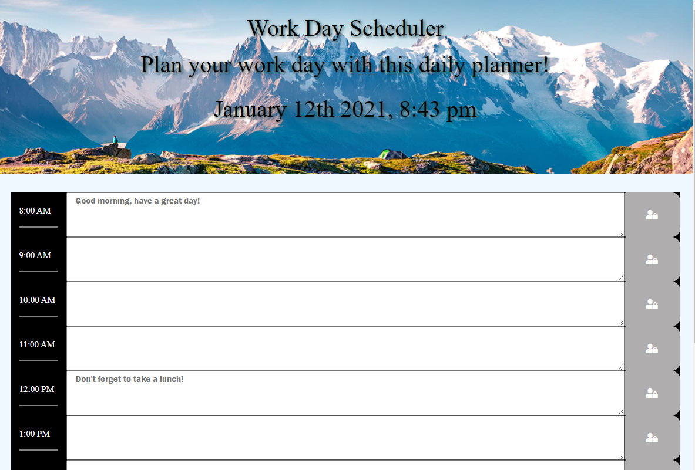

# day-planner

# languages used:
1. Html 
2. CSS
3. Javascript (moment.js for the time)

# additional sites used:
1. [bootstrap](https://getbootstrap.com/)
2. [font aweseom](https://fontawesome.com/icons?d=gallery)

# operation 
This app is mainly used to keep your daily work schedule organized. All work hours can be saved to the local storage of the user so that way your information is never lost. You can also use this calendar for reference showing you the past time, present, and future times all represented by a specific color.
    1. past color: black
    2. present color: light grey
    3. future color: red
Image of app:

[]
# resources
[moment.js youtube video for information on how to use moment](https://www.youtube.com/watch?v=n80RRNS1k64)
[jQuery](https://api.jquery.com/)
[moment.js site](https://momentjs.com/)
# url for active site
[day-planner](https://clintrizzo.github.io/day-planner/)
